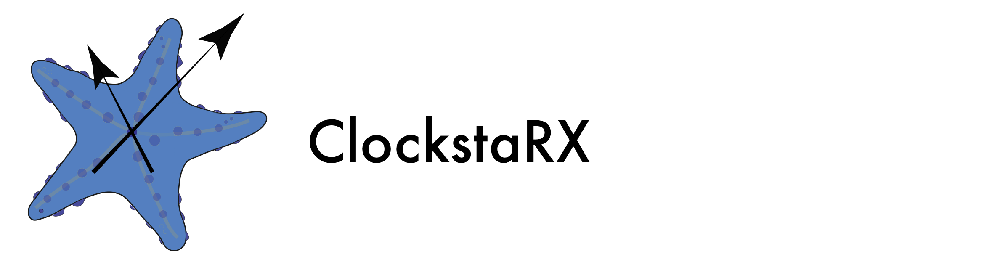
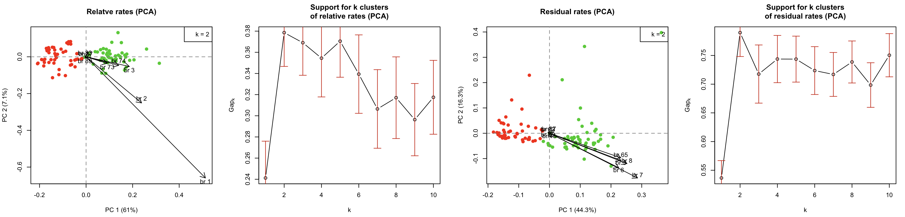

David Duchene, Mezzalina Vankan, Sebastian Duchene, and Simon Y.W. Ho.

david.duchene[at]anu.edu.au
Research School of Biology
Australian National University

30 May, 2020


Introduction to ClockstaRX
--------------------------

Estimating molecular evolutionary rates and evolutionary timescales with genome-scale data  is increasingly common in the biological sciences.

ClockstaRX is an R package for analyses of phylogenomic molecular evolutionary clocks. It takes the phylogenetic branch lengths of locus trees and a species tree topology. For each of the branches present in the species tree (represented as a quartet), the data on branch lengths is extracted from across locus trees. Cases where quartets are missing in locus trees are taken as missing data due to tree estimation error or discordant gene tree history.

The method represents the available data on relative molecular clocks in two dimensions (using MDS or PCA). ClockstaRX allows the user to visualize the variation of rates across the data and to identify the loci loci and lineages with outlying signals. It also identifies the optimal number of clocks in the data for subsequent molecular dating analysis with programs such as [BEAST](http://beast.bio.ed.ac.uk/Main_Page), [MrBayes](http://mrbayes.sourceforge.net/), [PhyloBayes](http://megasun.bch.umontreal.ca/People/lartillot/www/index.htm). 

Please follow [this link](http://bioinformatics.oxfordjournals.org/content/early/2013/12/02/bioinformatics.btt665.full) for the publication of the previous version of ClockstaR.

ClockstaRX requires [R](http://www.r-project.org/) and some R dependencies that can be obtained through R, as explained below.

Any queries on this version can be sent to David A. Duchene (david.duchene[at]anu.edu.au).


Quick start
-----------

The following instructions use the clockstarx_example_data folder, which contains some tree files in newick format. One is a file of locus trees (example_locus_trees.tre) and the other is a file of the species tree (example_species_tree.tre). To run ClockstaRX please format your data similar to the example data in clockstar_example_data.

ClockstaRX can be installed directly from GitHub. This requires the devtools package. Type the following code at the R prompt to install all the necessary tools (note you will need internet connection to download the packages directly).

```coffee
install.packages("devtools")
library(devtools)
install_github('ClockstaRX', 'duchene')
```

After downloading and installing, load ClockstaRX with the function *library*.

```coffee
library(ClockstaRX)
```

The rest of this tutorial uses the clockstar_example_data folder. The locus trees and species tree must be loaded into R as follows (example data set used).

```coffee
locus.trees <- read.tree("clockstarx_example_data/example_locus_trees.tre")
species.tree <- read.tree("clockstarx_example_data/example_species_tree.tre")
```

A complete analysis in ClockstaRX can then be performed using the *diagnose.clocks* function.

```coffee
example.analysis <- diagnose.clocks(locus.trees, species.tree, ncore = 2, make.plots = T, pdf.file = "example.clockstarx")
```

The printed output explains the steps performed and the objects saved (in this case in the R object *example.analysis*).

Using the argument make.plots = T as above will create one figure within R (not saved in drive). It shows the distribution of loci across the space of clocks, the branches of the unrooted species tree with the greatest contribution to variation, and the results of clustering.



ClockstaRX will also generate two PDF files. The first shows the space of (in this case as example.clockstarx.PCA.pdf and example.clockstarx.branchLoadings.pdf).


```coffee

```

Details of analysis steps and output
------------------------------------

Extracting the branch lengths of locus trees
--------------------------------------------


The first step is to load the trees to R.

```coffee

```

Next, we will obtain the branches of locus tres where possible, using the following code:

```coffee
raw.rates <- collect.clocks(locus.trees, species.tree, branch.support.threshold=0.5)
```

The output is a list with two objects: a matrix of the branch lengths collected, and a vector telling us the the number of loci that contained each of the species tre branches.

```coffee

```

Representing rates in two dimensions
------------------------------------

Now we will estimate the differences between loci in terms of their rates. Three distances are calculated by ClockstaRX: the raw differences in rates, the relative differences in patterns in branch lengths (sBSDmin distances), and the residual distances (sBSDmin distances after correcting rates by the mean length of a branch across all loci, as per Bedford and Hartl, 2008). ClockstaRX will fill missing branch length data with the mean across the branch data (or the mean across the whole data set where a branch is always absent).

```coffee
rate.space <- clock.space(raw.rates, species.tree, ncore = 2)
```

This might take some time due to the optimization of the sBSDmin matrix. The screen output should look like the following:

```coffee
[1] "Making pairwise comparisons..."
[1] "Starting parallel computing with 2 cores"
[1] "Finished parallel computing"
[1] "Starting parallel computing with 2 cores"
[1] "Finished parallel computing"
[1] "Finished making pairwise comparisons."
Initial stress        : 0.22087
stress after  10 iters: 0.11379, magic = 0.092
stress after  20 iters: 0.09011, magic = 0.043
stress after  30 iters: 0.06329, magic = 0.338
stress after  40 iters: 0.05932, magic = 0.500
```

The saved output includes...

Grouping loci by their clocks
-----------------------------

Now that we collected the reliable rates from locus trees and represented them in two-dimensional space, we can explore whether they form groups using k-means clustering. More details are available in Kaufman and Rousseeuw (2009) and in the documentation for package [cluster](http://cran.r-project.org/web/packages/cluster/index.html).

 
```coffee
clocks <- group.clocks(rate.space, make.plot=T)
```

This will perform a bootstrap to choose the best number of clocks in the dimensionality-reduced data:

```coffee
Clustering k = 1,2,..., K.max (= 10): .. done
Bootstrapping, b = 1,2,..., B (= 50)  [one "." per sample]:
.................................................. 50
Clustering k = 1,2,..., K.max (= 10): .. done
Bootstrapping, b = 1,2,..., B (= 50)  [one "." per sample]:
.................................................. 50
Clustering k = 1,2,..., K.max (= 10): .. done
Bootstrapping, b = 1,2,..., B (= 50)  [one "." per sample]:
.................................................. 50
```

The saved output will include ...

Finding explanations for the distribution of rates
--------------------------------------------------

We might want to know the reasons that rates vary across loci and across lineages. For example, we might want to know the impact of missing data, topological incongruence, or some other biological hypothesis (e.g., families of genes).

ClockstaRX allows us to do some default exploration as well as to provide our own variables for visualizing possible drivers of rates. However, these are only visual guides rather than proper statistical hypothesis tests.

The following will save a PDF to the current directory with some basic default diagnostics:

```coffee
ClockstaRX.outputs <- diagnose.clocks(clocks, locus.trees, species.tree, pdf.file= "trial.clock.space.pdf")
```

This saved output includes all of the output from previous ClockstaRX functions, and will lead to saved PDF graphics similar to the following:


We can also add our own data frame with particular variables that we wish to explore in the space:


```coffee
my.data <- data.frame("Data type" = c(rep("exon", 50), rep("intron", 50)), "GC content" = runif(100))
ClockstaRX.outputs.2 <- diagnose.clocks(clocks, locus.trees, species.tree, pdf.file= "trial.clock.space.2.pdf", other.data = my.data)
```


ClockstaRX can be run with other custom settings. Please see the documentation for other details or contact the authors at david.duchene[at]anu.edu.au.


References
----------

Duchene, S., & Ho, S. Y. (2014a). Using multiple relaxed-clock models to estimate evolutionary timescales from DNA sequence data. *Molecular Phylogenetics and Evolution* (77): 65-70.
Bedford, T., & Hartl, D. L. (2008). Overdispersion of the molecular clock: temporal variation of gene-specific substitution rates in Drosophila. Molecular biology and evolution, 25(8), 1631-1638.