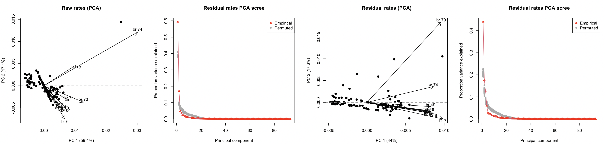
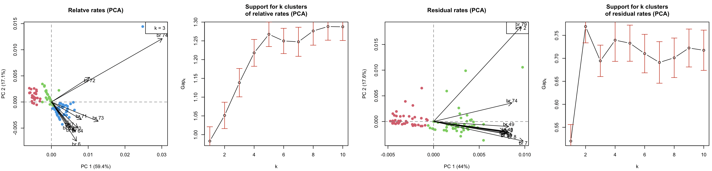
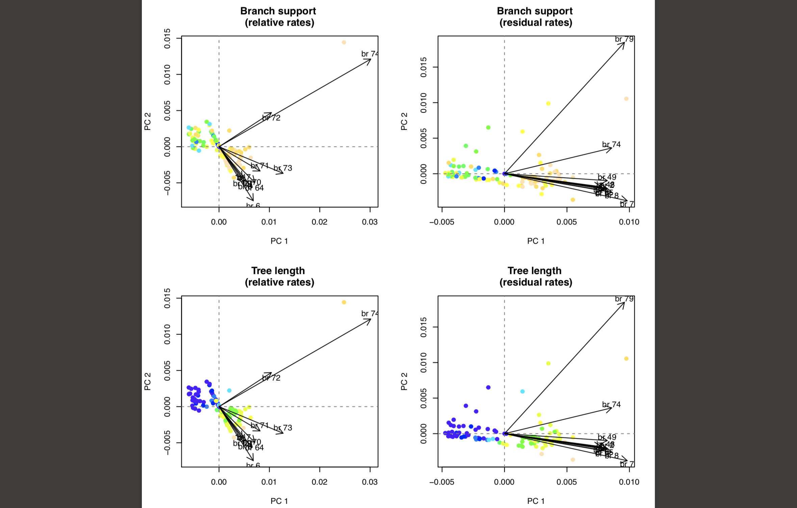
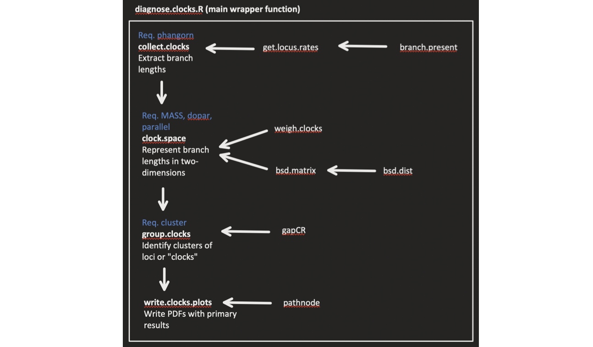

David Duchene, Mezzalina Vankan, Sebastian Duchene, and Simon Y.W. Ho.

david.duchene[at]anu.edu.au
Research School of Biology
Australian National University

30 May, 2020


Introduction to ClockstaRX
--------------------------

Estimating molecular evolutionary rates and evolutionary timescales with genome-scale data  is increasingly common in the biological sciences.

ClockstaRX is an R package for analyses of phylogenomic molecular evolutionary clocks. It takes the phylogenetic branch lengths of locus trees and a species tree topology. For each of the branches present in the species tree (represented as a quartet), the data on branch lengths is extracted from across locus trees. Cases where quartets are missing in locus trees are taken as missing data due to tree estimation error or discordant gene tree history.

The method represents the available data on relative molecular clocks in two dimensions (using MDS or PCA). ClockstaRX allows the user to visualize the variation of rates across the data and to identify the loci loci and lineages with outlying signals. It also identifies the optimal number of clocks in the data for subsequent molecular dating analysis with programs such as [BEAST](http://beast.bio.ed.ac.uk/Main_Page), [MrBayes](http://mrbayes.sourceforge.net/), [PhyloBayes](http://megasun.bch.umontreal.ca/People/lartillot/www/index.htm). 

Please follow [this link](http://bioinformatics.oxfordjournals.org/content/early/2013/12/02/bioinformatics.btt665.full) for the publication of the previous version of ClockstaR.

ClockstaRX requires [R](http://www.r-project.org/) and some R dependencies that can be obtained through R, as explained below.

Any queries on this version can be sent to David A. Duchene (david.duchene[at]anu.edu.au).


Quick start
-----------

The following instructions use the clockstarx_example_data folder, which contains some tree files in newick format. One is a file of locus trees (example_locus_trees.tre) and the other is a file of the species tree (example_species_tree.tre). To run ClockstaRX please format your data similar to the example data in clockstar_example_data.

ClockstaRX can be installed directly from GitHub. This requires the devtools package. Type the following code at the R prompt to install all the necessary tools (note you will need internet connection to download the packages directly).

```coffee
install.packages("devtools")
library(devtools)
install_github('ClockstaRX', 'duchene')
```

After downloading and installing, load ClockstaRX with the function *library*.

```coffee
library(ClockstaRX)
```

The rest of this tutorial uses the clockstar_example_data folder. The locus trees and species tree must be loaded into R as follows (example data set used).

```coffee
locus.trees <- read.tree("clockstarx_example_data/example_locus_trees.tre")
species.tree <- read.tree("clockstarx_example_data/example_species_tree.tre")
```

A complete analysis in ClockstaRX can then be performed using the *diagnose.clocks* function. Note that all trees will be unrooted in the analysis.

```coffee
example.analysis <- diagnose.clocks(locus.trees, species.tree, ncore = 2, make.plots = T, pdf.file = "example.clockstarx")
```

The printed output explains the steps performed and the objects saved (in this case in the R object *example.analysis*).

Using the argument make.plots = T as above will create one figure within R (not saved in drive). It shows the distribution of loci across the space of clocks, the branches of the unrooted species tree with the greatest contribution to variation, and the results of clustering.





ClockstaRX will also generate two PDF files when using make.plots = T.

The first PDF in this case is called example.clockstarx.PCA.pdf, and shows the space of clocks with loci coloured by several basic variables that could explain the distribution of loci (number of taxa per locus, missing data, branch support, tree length, clocklikeness, topological distance to species tree). Warm colours indicate high values of each variable.

The first column shows raw data and the second shows data corrected by the mean across all loci (or residual rates, as proposed by Bedford and Hartl, 2008, Mol. Biol. Evol. 25(8), 1631-1638).





Further variables can be added as a *diagnose clocks* using the other.data argument. Other variables must be an R data.frame.

The second PDF file, in this case called example.clockstarx.branchLoadings.pdf, shows the species tree with branches coloured by their PC loadings. The first two trees show the loadings of branches in the space of raw branch data (PC1 and PC2, respectively), and the next two trees show the loadings in the space of corrected branch data. The following is an example. Warm colours indicate high loadings.





Details of analysis steps and output
------------------------------------

The following diagram describes a stepwise analysis using ClockstaRX and the output at every step.





Extracting the branch lengths of locus trees
--------------------------------------------

We can obtain the branches of locus tres where possible, using the following code:

```coffee
raw.rates <- collect.clocks(locus.trees, species.tree, branch.support.threshold=0.5)
Output includes:
1. raw.rates.matrix
2. N.loci.per.branch
3. N.samples.tree
4. median.clock.tree
```

The objects in the output include: (1) the matrix of branch lengths in the data, which can include missing data if quartets in the species tree were not present in locus trees; (2) the number of loci in each of the branches of the unrooted species tree; (3) unrooted species tree with branch lengths replaced with number of samples across loci (i.e., a branch of length zero indicates no loci contained the quartet); (4) unrooted species tree with branch lengths replaced with the mean length across the loci containing the quartet.

Representing rates in two dimensions
------------------------------------

Now we will represent the space of branch length patterns across loci in two dimensions.

The space of these data can be represented in two dimensions using either principal components analysis (PCA) or multi-dimensional scaling (MDS). The latter option requires calculation of the pairwise distances between branches (sBSDmin distances), which can be computationally demanding and ideally calculated with multiple cores (argument ncore).

In order to avoid adding distortions to the space, ClockstaRX will fill missing branch length data with the mean across the data for each given branch (or the mean across the whole data set where the data are entirely absent).

Under MDS the analysis will not be used to identify the contribution of each of the branches to space. However, MDS dimensions can be further corrected using Sammon's non-linear mapping, which facilitates visualisation and clustering of the data.

```coffee
rate.space <- clock.space(raw.rates, species.tree, pca = T, mds = F, log.branches = T, mean.scaling.brlen = 0.05, ncore = 1, m
ake.plots = F, sammon.correction = F)
Saving results PDFs
Output includes:
1. raw.rates.matrix
2. N.loci.per.branch
3. N.samples.tree
4. median.clock.tree
5. imputed.clocks
6. weighted.imputed.clocks
7. pca.clock.space
8. weighted.pca.clock.space
```

Analyses using MDS will have additional outputs printed to the screen.

The basic output of this function includes the same as in the first step with a few additions: (5) a matrix of branch lengths across loci where missing data have been filled (as explained above); (6) a matrix of weighted branch lengths across loci by the mean value across the data (method described in Bedford and Hartl, 2008); (7) PCA results including the data in two dimensions, branch loadings (their contribution to each principal component), and further statistics; (8) PCA results of weighted branch length data.

Grouping loci by their clocks
-----------------------------

Now that we collected the reliable rates from locus trees and represented them in two-dimensional space, we can explore whether they form groups using k-means clustering. More details are available in Kaufman and Rousseeuw (2009) and in the documentation for package [cluster](http://cran.r-project.org/web/packages/cluster/index.html).

 
```coffee
clocks <- group.clocks(rate.space, boot.samps = 100, kmax = 10, make.plots = T)

Clustering k = 1,2,..., K.max (= 10): .. done
Bootstrapping, b = 1,2,..., B (= 50)  [one "." per sample]:
.................................................. 50
Clustering k = 1,2,..., K.max (= 10): .. done
Bootstrapping, b = 1,2,..., B (= 50)  [one "." per sample]:
.................................................. 50
Output includes:
.
.
.
9. pca.cluster.support
10. weighted.pca.cluster.support
11. pca.clustering
12. weighted.pca.clustering
13. pca.best.k
14. weighted.pca.best.k
```

This will perform a bootstrap to choose the best number of clocks in the dimensionality-reduced data.

The new elements in the output are: (9-10) the support for different numbers of clusters in each of the two treatments of branch lengths (raw and weighted); (11-12) the cluster for each locus in the best scheme of clustering; (13-14) the best number of clusters, k, identified in the data.

Finding explanations for the distribution of rates
--------------------------------------------------

ClockstaRX can be used to explore some of the reasons for rate variation across loci and across lineages, including the impact of missing data, topological incongruence, or user-provided data (e.g., families of genes, data quality). These explorations are primarily visual guides rather than including statistical hypothesis tests.

The following will save a PDF to the current directory with some basic default diagnostics.

```coffee
ClockstaRX.outputs <- write.clocks.plots(clocks, locus.trees, species.tree, pdf.file = "clock.diagnosis")
```

This saved output includes all of the output from previous ClockstaRX functions, and will save PDF graphics as shown in the quick start guide of this readme file.

Additional variables can be explored as a data frame with any number of columns to the argument other.data as in the following mock example.


```coffee
my.data <- data.frame("Data type" = c(rep("exon", 50), rep("intron", 50)), "GC content" = runif(100))
ClockstaRX.outputs.2 <- diagnose.clocks(clocks, locus.trees, species.tree, locus.trees, species.tree, pdf.file = "clock.diagnosis.2", other.data = my.data)
```


References
----------

Duchene, S., & Ho, S. Y. (2014a). Using multiple relaxed-clock models to estimate evolutionary timescales from DNA sequence data. *Molecular Phylogenetics and Evolution* (77): 65-70.
Bedford, T., & Hartl, D. L. (2008). Overdispersion of the molecular clock: temporal variation of gene-specific substitution rates in Drosophila. Molecular biology and evolution, 25(8), 1631-1638.